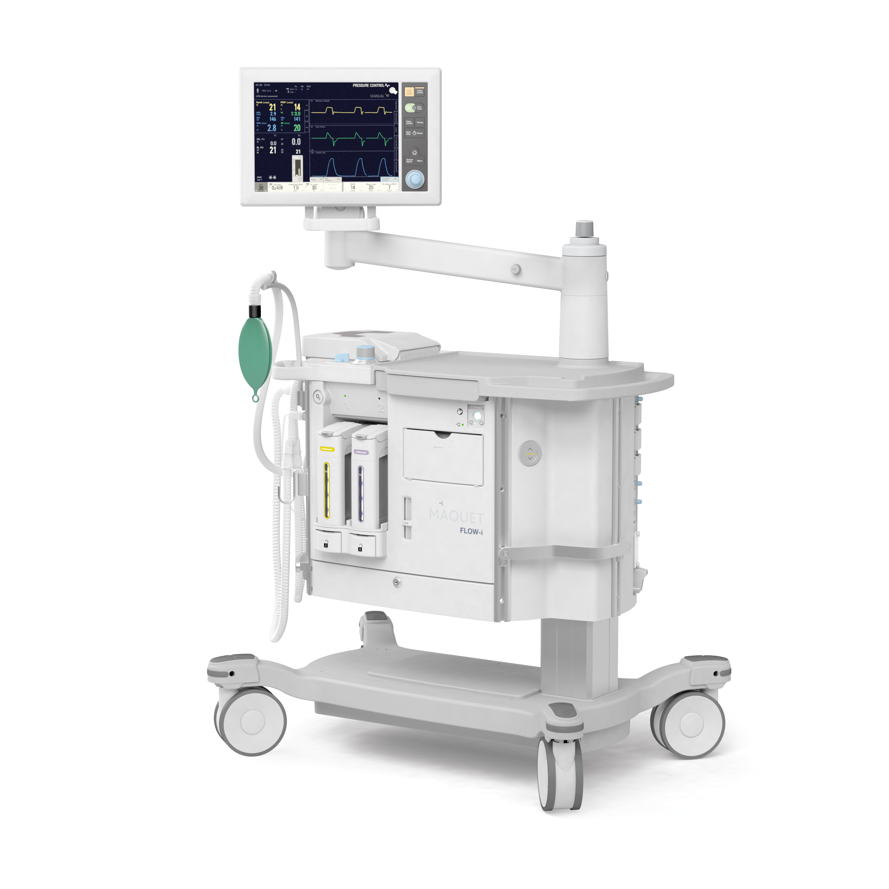

## Introduction
 
The Worcestershire Acute Hospitals NHS Trust (WAHNT) has three major hospitals in the Worcestershire area, have over seven thousands staff and, importantly to this Pilot, have more than fifty anaesthetists who rely on fifty or more anaesthetic machines.

 

For a bit of background, an anaesthetic machine is an integrated set of instruments, devices and monitoring tools that an anaesthetist uses during an operation to render a patient unconscious, monitor all their vital signs and keep them comfortable before, during and after an operation.

 

Clearly, this is a vital tool that must be chosen wisely by those responsible for procurement, the anaesthetists that will user them, the clinicians that are dependent upon them working correctly during operations and the ethics and quality control departments of the hospital.

 

Here's a typical anaesthetic machine.

In use this machine is festooned with cables and tubes leading to the patient and other devices in use in the operating theatre.

These machines cost on average about £50,000 each (though the range is form about £10,000 to £100,000 depending on the requirements of the operations that will be performed using it).

Making the right choice is, therefore, extremely important. Worcestershire need to buy fifty or more of these!

## Nature of the Pilot

Those responsible for the purchase of the fifty or more anaesthetic machines in WAHNT need to ensure that they acquire as much information as possible before making a purchase.

In this case, WAHNT want to take into consideration the opinions of the anaesthetists that will be using the new machines for a number of years and will therefore be evaluating the possible new machines over a period of several weeks.

To make the most of this evaluation period they have elected to use Malue to collect those opinions.

This pilot is, therefore, a Production environment deployment where the system will be put in front of all of the anaesthetists participating in the survey (all of them!), the participants will be encouraged by the WAHNT management to complete the Malue Evaluation - i.e. it will be mandatory for them to participate - and the data collected used as a decision support mechanism for the final purchase of the machines.

## Pilot Requirements
 
The BOA Pilot deployed last year had most of the components required for this Pilot. However for the sake o0f completeness the following table shows all of the necessary components and features necessary also showing where these are new and where we have already (as of 7th February 2024) been included in our development plan.

<table border=1 cellpadding=0 cellspacing=0 valign=top style='direction:ltr;
 border-collapse:collapse;border-style:solid;border-color:#A3A3A3;border-width:
 1pt' title="" summary="">
 <tr>
  <td style='border-style:solid;border-color:#A3A3A3;border-width:1pt;
  background-color:#9CC3E5;vertical-align:top;width:2.327in;padding:2.0pt 3.0pt 2.0pt 3.0pt'>
  
Requirement

  </td>
  <td style='border-style:solid;border-color:#A3A3A3;border-width:1pt;
  background-color:#9CC3E5;vertical-align:top;width:4.5222in;padding:2.0pt 3.0pt 2.0pt 3.0pt'>
  
Description

  </td>
 </tr>
 <tr>
  <td style='border-style:solid;border-color:#A3A3A3;border-width:1pt;
  vertical-align:top;width:2.327in;padding:2.0pt 3.0pt 2.0pt 3.0pt'>
  
Environment

  </td>
  <td style='border-style:solid;border-color:#A3A3A3;border-width:1pt;
  vertical-align:top;width:4.5222in;padding:2.0pt 3.0pt 2.0pt 3.0pt'>
  
Production

  </td>
 </tr>
 <tr>
  <td style='border-style:solid;border-color:#A3A3A3;border-width:1pt;
  vertical-align:top;width:2.327in;padding:2.0pt 3.0pt 2.0pt 3.0pt'>
  
Data Retention

  </td>
  <td style='border-style:solid;border-color:#A3A3A3;border-width:1pt;
  vertical-align:top;width:4.5222in;padding:2.0pt 3.0pt 2.0pt 3.0pt'>
  
Long term (this
  may be subject to archiving at some stage).

  </td>
 </tr>
 <tr>
  <td style='border-style:solid;border-color:#A3A3A3;border-width:1pt;
  vertical-align:top;width:2.327in;padding:2.0pt 3.0pt 2.0pt 3.0pt'>
  
Deployment Date

  </td>
  <td style='border-style:solid;border-color:#A3A3A3;border-width:1pt;
  vertical-align:top;width:4.5222in;padding:2.0pt 3.0pt 2.0pt 3.0pt'>
  
w/b 19th August
  2024

  </td>
 </tr>
 <tr>
  <td style='border-style:solid;border-color:#A3A3A3;border-width:1pt;
  vertical-align:top;width:2.327in;padding:2.0pt 3.0pt 2.0pt 3.0pt'>
  
Target apps

  </td>
  <td style='border-style:solid;border-color:#A3A3A3;border-width:1pt;
  vertical-align:top;width:4.5298in;padding:2.0pt 3.0pt 2.0pt 3.0pt'>
  
Web ( iOS, Android
  ? )

  
&nbsp;

  
The iOS and
  Android targets are still in discussion dependent upon the readiness of the
  deployment mechanism. 

  </td>
 </tr>
 <tr>
  <td style='border-style:solid;border-color:#A3A3A3;border-width:1pt;
  vertical-align:top;width:2.327in;padding:2.0pt 3.0pt 2.0pt 3.0pt'>
  
Evaluation
  Components and Features required in the Evaluation for WAHNT.

  </td>
  <td style='border-style:solid;border-color:#A3A3A3;border-width:1pt;
  vertical-align:top;width:4.6548in;padding:2.0pt 3.0pt 2.0pt 3.0pt'>
  

  <table border=1 cellpadding=0 cellspacing=0 valign=top style='direction:ltr;
   border-collapse:collapse;border-style:solid;border-color:#A3A3A3;border-width:
   1pt' title="" summary="">
   <tr>
    <td style='border-style:solid;border-color:#A3A3A3;border-width:1pt;
    background-color:#9CC3E5;vertical-align:top;width:1.2972in;padding:2.0pt 3.0pt 2.0pt 3.0pt'>
    
Component / Feature

    </td>
    <td style='border-style:solid;border-color:#A3A3A3;border-width:1pt;
    background-color:#9CC3E5;vertical-align:top;width:3.1743in;padding:2.0pt 3.0pt 2.0pt 3.0pt'>
    
New Requirements / Description

    </td>
   </tr>
   <tr>
    <td style='border-style:solid;border-color:#A3A3A3;border-width:1pt;
    vertical-align:top;width:1.2972in;padding:2.0pt 3.0pt 2.0pt 3.0pt'>
    
Text

    </td>
    <td style='border-style:solid;border-color:#A3A3A3;border-width:1pt;
    vertical-align:top;width:3.2034in;padding:2.0pt 3.0pt 2.0pt 3.0pt'>
    
Ability to specify the size of the text area and the placeholder
    text. See <a
    href="https://dev.azure.com/Malue/Malue%20Proof%20of%20Concept/_workitems/edit/608">Work Item 608</a>

    </td>
   </tr>
   <tr>
    <td style='border-style:solid;border-color:#A3A3A3;border-width:1pt;
    vertical-align:top;width:1.2972in;padding:2.0pt 3.0pt 2.0pt 3.0pt'>
    
Radio Buttons

    </td>
    <td style='border-style:solid;border-color:#A3A3A3;border-width:1pt;
    vertical-align:top;width:3.1743in;padding:2.0pt 3.0pt 2.0pt 3.0pt'>
    
n/a

    </td>
   </tr>
   <tr>
    <td style='border-style:solid;border-color:#A3A3A3;border-width:1pt;
    vertical-align:top;width:1.2972in;padding:2.0pt 3.0pt 2.0pt 3.0pt'>
    
Numeric

    </td>
    <td style='border-style:solid;border-color:#A3A3A3;border-width:1pt;
    vertical-align:top;width:3.1743in;padding:2.0pt 3.0pt 2.0pt 3.0pt'>
    
n/a

    </td>
   </tr>
   <tr>
    <td style='border-style:solid;border-color:#A3A3A3;border-width:1pt;
    vertical-align:top;width:1.2972in;padding:2.0pt 3.0pt 2.0pt 3.0pt'>
    
Matrix

    </td>
    <td style='border-style:solid;border-color:#A3A3A3;border-width:1pt;
    vertical-align:top;width:3.1743in;padding:2.0pt 3.0pt 2.0pt 3.0pt'>
    
n/a

    </td>
   </tr>
   <tr>
    <td style='border-style:solid;border-color:#A3A3A3;border-width:1pt;
    vertical-align:top;width:1.2972in;padding:2.0pt 3.0pt 2.0pt 3.0pt'>
    
Content

    </td>
    <td style='border-style:solid;border-color:#A3A3A3;border-width:1pt;
    vertical-align:top;width:3.1743in;padding:2.0pt 3.0pt 2.0pt 3.0pt'>
    
n/a

    </td>
   </tr>
   <tr>
    <td style='border-style:solid;border-color:#A3A3A3;border-width:1pt;
    vertical-align:top;width:1.2972in;padding:2.0pt 3.0pt 2.0pt 3.0pt'>
    
Prioritizable
    List

    </td>
    <td style='border-style:solid;border-color:#A3A3A3;border-width:1pt;
    vertical-align:top;width:3.1743in;padding:2.0pt 3.0pt 2.0pt 3.0pt'>
    
A component like
    multiple choice but with the ability to set a priority. See <a
    href="https://dev.azure.com/Malue/Malue%20Proof%20of%20Concept/_workitems/edit/605">Work
    Item 605 and dependants</a>

    </td>
   </tr>
   <tr>
    <td style='border-style:solid;border-color:#A3A3A3;border-width:1pt;
    vertical-align:top;width:1.3145in;padding:2.0pt 3.0pt 2.0pt 3.0pt'>
    
Tooltips and
    Help

    </td>
    <td style='border-style:solid;border-color:#A3A3A3;border-width:1pt;
    vertical-align:top;width:3.2263in;padding:2.0pt 3.0pt 2.0pt 3.0pt'>
    
Ability to have
    tooltips associated with any component and a help pop up see <a
    href="https://dev.azure.com/Malue/Malue%20Proof%20of%20Concept/_workitems/edit/609">Work
    Item 609</a>

    </td>
   </tr>
   <tr>
    <td style='border-style:solid;border-color:#A3A3A3;border-width:1pt;
    vertical-align:top;width:1.2972in;padding:2.0pt 3.0pt 2.0pt 3.0pt'>
    
Invitation only
    sign on

    </td>
    <td style='border-style:solid;border-color:#A3A3A3;border-width:1pt;
    vertical-align:top;width:3.2305in;padding:2.0pt 3.0pt 2.0pt 3.0pt'>
    
A list of participants' email addresses will be provided by
    WAHNT. We will need to create these users with initial passwords. This will
    either be performed by hand or script (see <a href="http://">Work Item TBA if required</a>).

    
&nbsp;

    
It will be
    necessary to allow users to change passwords. 

    </td>
   </tr>
   <tr>
    <td style='border-style:solid;border-color:#A3A3A3;border-width:1pt;
    vertical-align:top;width:1.2972in;padding:2.0pt 3.0pt 2.0pt 3.0pt'>
    
&nbsp;

    </td>
    <td style='border-style:solid;border-color:#A3A3A3;border-width:1pt;
    vertical-align:top;width:3.1743in;padding:2.0pt 3.0pt 2.0pt 3.0pt'>
    
&nbsp;

    </td>
   </tr>
  </table>
  

  </td>
 </tr>
 <tr>
  <td style='border-style:solid;border-color:#A3A3A3;border-width:1pt;
  vertical-align:top;width:2.327in;padding:2.0pt 3.0pt 2.0pt 3.0pt'>
  
Reporting

  </td>
  <td style='border-style:solid;border-color:#A3A3A3;border-width:1pt;
  vertical-align:top;width:4.5222in;padding:2.0pt 3.0pt 2.0pt 3.0pt'>
  
Separate PowerBI
  reporting will be created by the analyst team as per the BOA Pilot.

  </td>
 </tr>
 <tr>
  <td style='border-style:solid;border-color:#A3A3A3;border-width:1pt;
  vertical-align:top;width:2.327in;padding:2.0pt 3.0pt 2.0pt 3.0pt'>
  
Evaluation
  Template

  </td>
  <td style='border-style:solid;border-color:#A3A3A3;border-width:1pt;
  vertical-align:top;width:4.5222in;padding:2.0pt 3.0pt 2.0pt 3.0pt'>
  
Draft template
  designed and in final discussion with WAHNT. 

  </td>
 </tr>
</table>

&nbsp;

